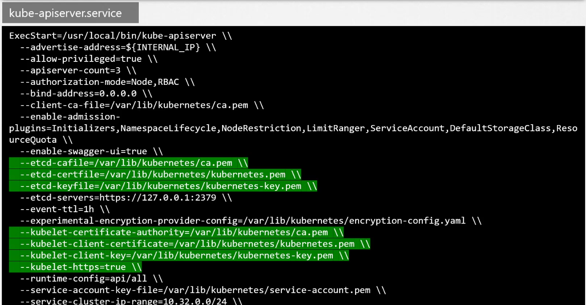
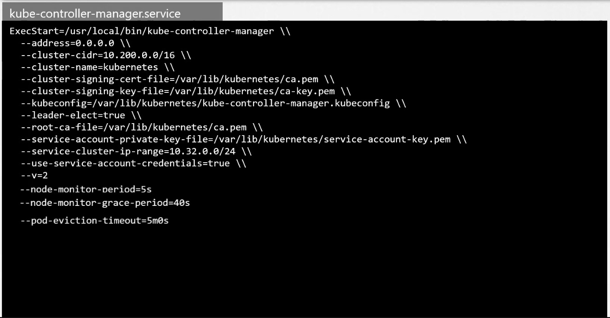
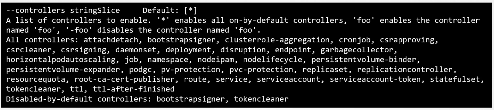

# ETCD

## Configuration
- advertise-client-urls: IP donde escucha etcd. Puerto 2379. Se ve en etcd.service
- kubeadm despliega etcd como un pod .
- etcdctl para controlar etcd
- Si está configurado como cluster la configuración del servicio etcd.service --initia-cluster nombrenodo=urlnodo:2380
- Para conectarse con etcd es necesario usar los certificados que están en el etcd-master en estas rutas:
```
--cacert /etc/kubernetes/pki/etcd/ca.crt
--cert /etc/kubernetes/pki/etcd/server.crt
--key /etc/kubernetes/pki/etcd/server.key
```


# kube-apiserver
- Es donde llegan todas las peticiones.
- kubectl accede a kube-apiserver
- kubeadm lo configura por defecto como un pod en kube-system
- La configuración se encuentra en el kube-apiserver.service




# Kube-Controller-Manager
- los controladores revisan el estado de lo que gestionan y si detectan una diferencia con el estado deseado, ejecutan las acciones para remediarlo.
- ejemplo: Node-Contoller
  - Consulta la salud de los nodos cada 5s.
  - Si el nodo no contesta en 40s lo declara como UNREACHABLE
  - Si a los 300 segundos no se recupera, comienza a mover los pods a otros nodos.
- ejemplo: Replication-Controller
  - Se encarga de revisar el número de replicas que hay en un deployment.
- Toda la configuración se encuentra en Kube-Controller-Manager



- Por defecto están habilitados todos los controllers. Puedes cambiar la configuración en el mismo fichero de configuración del servicio:



- kubeadm lo instala como un pod en kube-system

